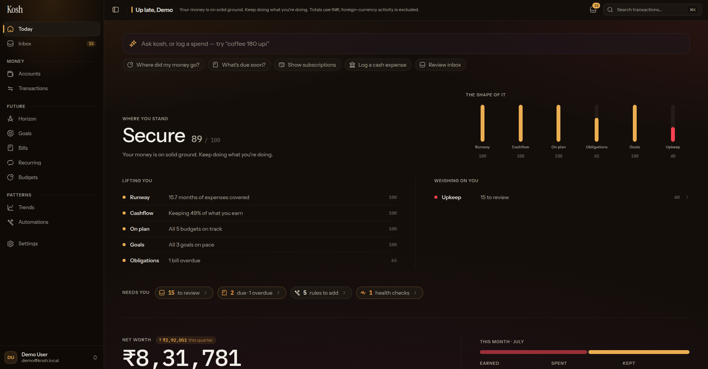

# Hermes Finance

Hermes Finance é um fork do Kosh estendido com um motor determinístico de posição financeira, forecast e planejamento de decisões. A infraestrutura do Kosh continua sendo a base; veja [a arquitetura](docs/ARCHITECTURE.md), [o domínio](docs/DOMAIN.md) e [a política de upstream](docs/UPSTREAM.md).

Kosh is a self-hosted personal-finance app for people who want to manage their
own accounts, transactions, budgets, bills, recurring commitments, goals, CSV
imports, and reports without handing their ledger to a hosted product.

It is practical finance software, not financial advice. Verify important
decisions independently.



## Features

Inherited from Kosh:

- Accounts, transactions, transfers, categories, tags, and CSV imports.
- Budgets, bills, recurring transaction drafts, savings goals, and reports.
- Exact integer-minor-unit money math; no invented foreign-exchange rates.
- Optional AI-assisted questions through Google Gemini, disabled by default.
- Optional, read-only external MCP access with per-user tokens.
- PostgreSQL backups, migration verification, and deployment health checks.

Added by Hermes Finance:

- **Forecast engine** — a reproducible daily cash trajectory. Every event
  carries provenance and a confidence level, and the best-known fact for a
  commitment supersedes every weaker estimate of it.
- **Safe-to-spend** — the largest amount you can spend now without ever
  breaching a protected reserve, measured at the *trough* of the curve rather
  than at the end of the horizon.
- **Brazilian credit-card domain** — real billing cycles, statement
  reconciliation, and installment plans. A purchase is an economic expense on
  its purchase date; the only cash movement is the statement settlement.
- **Purchase planner** — plans, items, payment options, and deterministic
  simulation of what a purchase does to your cash.
- **Payment comparator** — ranks à vista against installment plans under hard
  constraints (balance floor, hard reserve, card limit, deadline) and explains
  every verdict. When no option is viable it says so instead of inventing one.
- **OFX and CSV imports**, idempotent by external id or fingerprint.
- **MCP finance tools** so an agent can query the engine — never the tables.

## Architecture

```text
Next.js web app (apps/web)          MCP / Hermes agent
        |                                   |
        +--------------- adapters ----------+
        |
        +-- Better Auth sessions, API routes, in-process jobs
        |
PostgreSQL <---- Drizzle schema and migrations (packages/db)
        |
Domain rules and calculations (packages/domain)
Forecast engine, pure (packages/forecast)
Safe-to-spend and planning, pure (packages/planning)
```

`packages/forecast` and `packages/planning` are pure domain: no React, Next.js,
PostgreSQL, MCP, or model provider. They take normalized integer-minor-unit
facts and return deterministic results. The model may explain those results; it
never produces them.

Kosh is a pnpm/Turborepo workspace. Normal finance data stays in your
PostgreSQL database. CSV imports are parsed and stored in that database; Kosh
does not currently persist uploaded attachments to the storage volume.

## Requirements

- Node.js 22.13 or newer
- pnpm 11 (`corepack enable` is the simplest installation path)
- PostgreSQL 16 or compatible
- Docker and Docker Compose, optional

## Local development

```bash
cp .env.example .env
pnpm install --frozen-lockfile
docker compose up -d db
pnpm db:migrate
pnpm db:seed
pnpm dev
```

Open <http://localhost:3000>. The seed recreates this development-only account:

```text
demo@kosh.local / demo1234
```

Do not run `pnpm db:seed` against a database containing data you care about:
it deliberately replaces the demo user and its related records.

## Docker Compose

The Compose stack starts PostgreSQL, runs migrations, then starts Kosh. Its
database hostname is `db`, unlike local development's `localhost` default.

```bash
export POSTGRES_PASSWORD="$(openssl rand -base64 24 | tr '/+' '_-')"
export BETTER_AUTH_SECRET="$(openssl rand -base64 32)"
export KOSH_ENCRYPTION_KEY="$(openssl rand -base64 32)"
export APP_URL="http://localhost:3000"
export DATABASE_URL="postgres://kosh:${POSTGRES_PASSWORD}@db:5432/kosh"
docker compose up --build
```

Compose binds the web port to `127.0.0.1` by default. Put a TLS-terminating
reverse proxy in front of a non-loopback deployment and set a public HTTPS
`APP_URL`. Set `KOSH_BIND_ADDRESS=0.0.0.0` only when you deliberately need a
direct network binding.

## Configuration

Copy `.env.example` to `.env`. It documents every supported setting. The main
ones are:

| Variable | Required | Purpose |
| --- | --- | --- |
| `DATABASE_URL` | Yes | PostgreSQL connection string. |
| `BETTER_AUTH_SECRET` | Yes | Session-signing secret; use `openssl rand -base64 32`. |
| `APP_URL` | Yes | Canonical application URL for auth and links. |
| `POSTGRES_PASSWORD` | Compose | Password for the bundled PostgreSQL service. |
| `KOSH_ENCRYPTION_KEY` | Production | Base64 32-byte key for selected sensitive columns. |
| `KOSH_DISABLE_JOBS` | No | Disables in-process background jobs. |
| `KOSH_AI_ENABLED` / `GEMINI_API_KEY` | No | Enables the optional Gemini integration. |
| `KOSH_MCP_ENABLED` | No | Enables the optional external, read-only MCP endpoint. |

Production startup rejects default database credentials, a weak/default auth
secret, non-HTTPS non-loopback `APP_URL`, and a missing encryption key.

## Database, migrations, and backup

```bash
pnpm db:migrate       # apply Drizzle migrations
pnpm db:seed          # recreate development demo data
pnpm db:verify        # verify database guardrails
pnpm db:backup        # create a PostgreSQL custom-format backup
pnpm db:migrate:safe  # back up, migrate, and verify
```

Use `pnpm db:restore:fresh` only with a fresh target database and an explicit
`BACKUP_FILE`. Full deployment, update, recovery, and restore instructions are
in [docs/operations.md](docs/operations.md).

## Testing and checks

```bash
pnpm lint
pnpm typecheck
pnpm test
pnpm test:operations
pnpm build
```

`pnpm test` runs domain and server tests. `pnpm test:operations` checks backup
retention behavior without touching a database. CI also runs a fresh-and-upgrade
migration rehearsal and checks the production container.

The HTTP smoke tests in `scripts/verify-security.mjs` and
`scripts/verify-flows.mjs` require a running server and a disposable database;
they create users and data. They are intentionally not part of the normal test
command.

## Security and privacy

Kosh stores money as exact integer minor units. Normal finance data stays in
the self-hosted application and PostgreSQL database. Direct database access is
a trusted administrative boundary and can bypass application-level ownership
checks; protect database credentials and backups accordingly.

### Application-level encryption

Set `KOSH_ENCRYPTION_KEY` to a base64-encoded 32-byte key:

```bash
openssl rand -base64 32
```

In production this key is required. When configured, Kosh encrypts these
columns with AES-256-GCM before they are written to PostgreSQL:

- `accounts.account_number_mask`, `accounts.upi_id`, and `accounts.notes`
- `transactions.notes`, `transactions.narration`, `transactions.counterparty_upi_id`,
  `transactions.upi_reference`, and `transactions.utr_number`
- `bills.notes`

The key is not stored in the database. Back it up separately: losing it makes
encrypted data unrecoverable. This is server-side encryption, not end-to-end
encryption, and does not replace encrypted disks, protected database access, or
encrypted backup destinations. Existing plaintext records remain readable after
a key is introduced; run `pnpm db:encrypt` once to backfill them.

### Optional external services

AI and MCP are off by default. When `KOSH_AI_ENABLED=true`, Ask Kosh sends the
question, relevant conversation context, and selected tool results to Google
Gemini. It does not send the whole database, but it is still an external
service; leave it disabled if that is not acceptable for your deployment.
External MCP tokens are read-only and opt-in.

Kosh does not claim compliance certification or a security guarantee. See
[SECURITY.md](SECURITY.md) to report vulnerabilities privately.

## Operations

Kosh runs pg-boss jobs in the web process by default for recurring drafts,
budget carry-forward, bill checks, and health pulses. Set
`KOSH_DISABLE_JOBS=true` for constrained environments.

Before an update, take and test a PostgreSQL backup; `pnpm db:migrate:safe`
does this automatically. The current Docker storage volume exists for
deployment health checks. Kosh does not yet store user attachments there, so
the PostgreSQL archive is the data backup that matters today.

### Troubleshooting

- `ECONNREFUSED` locally usually means PostgreSQL is not running; use
  `docker compose up -d db` and keep `.env` pointing at `localhost`. The
  container publishes 5432 on the loopback interface only.
- If host port 5432 is already taken by another project, set
  `POSTGRES_HOST_PORT` to a free port and point `DATABASE_URL` at it; the
  in-network URL used by Compose (`db:5432`) is unaffected.
- Compose migration failures caused by a `localhost` database URL mean the
  container cannot reach the host. Export the Compose-only URL shown above,
  using host `db`.
- A port-3000 conflict can be resolved by stopping the other service or setting
  a different host mapping in `docker-compose.yml`.
- If Next.js falls back to another port because 3000 is taken, set `APP_URL` to
  the port actually in use and restart. Better Auth validates the browser's
  `Origin` against `APP_URL`, so a mismatch makes sign-in fail with a bare 403
  and `[Better Auth]: Invalid origin` in the server log — the login form itself
  gives no hint. The check only runs once the request carries a cookie, so a
  bare `curl` will succeed against a misconfigured server while a browser fails.
- Two servers can both hold "port 3000" if one binds IPv4 and the other IPv6;
  `localhost` then resolves to whichever the client prefers. Pick a port nothing
  else uses rather than relying on that.
- Production configuration errors identify the missing or unsafe environment
  value at startup. Do not weaken those checks with example secrets.

## Roadmap

- Keep the ledger, imports, planning, and reporting flows dependable.
- Improve self-hosted deployment and recovery ergonomics.
- Add integrations only when they preserve the self-hosted, privacy-first model.
- Next up: credit-card statement PDF parsing, global purchase optimization,
  suggested purchase dates, and recurring detection. Open Finance stays behind
  a provider interface so adding it never touches the forecast engine.

## Contributing

Issues and pull requests are welcome. Start with [CONTRIBUTING.md](CONTRIBUTING.md)
and use the provided issue and pull-request templates.

## License

Kosh is licensed under the [GNU Affero General Public License v3.0 only](LICENSE).
AGPL keeps modified versions offered to users over a network subject to the same
source-sharing obligation; choose it if that reciprocal freedom matters more
than permissive reuse.
